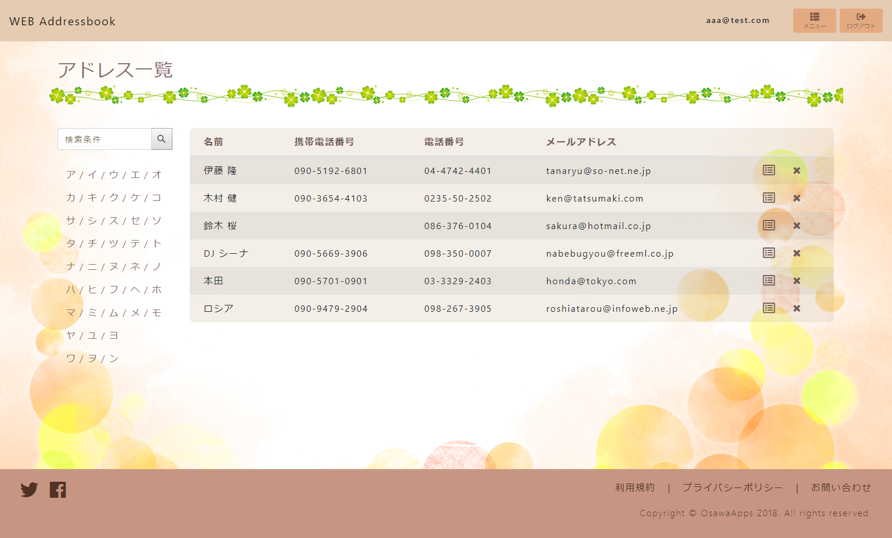
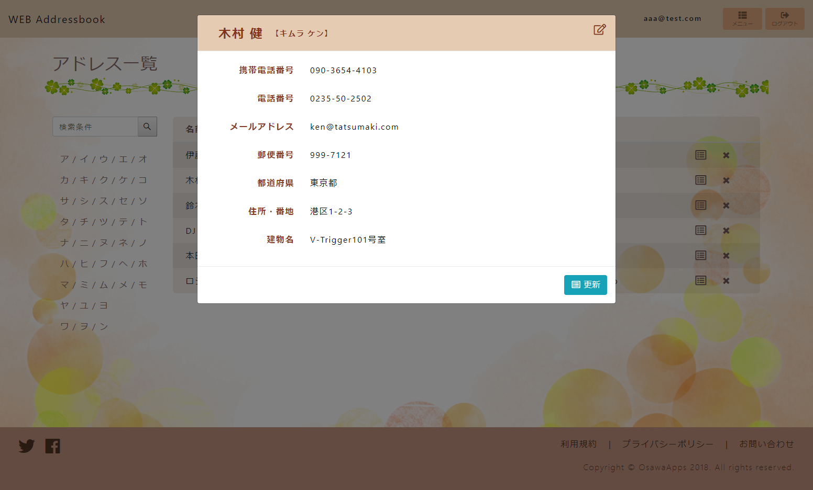

# WEBアドレス帳（Springboot Practice）

## 概要

* アドレス情報を登録、検索、更新、削除するだけの単純なアプリにする。

 

## その他

* Bootstrap4 を使用して画面を作成する。

* SpringSecurity を使用してログイン機能を作成する。

* よくある感じのデザインにする。

 

## 画面サンプル

* TOP

 

* アドレス一覧

 

* 詳細

 

## 参考書

* SpringFramework5 プログラミング入門

    * http://www.shuwasystem.co.jp/products/7980html/5374.html

* SpringBoot2 プログラミング入門

    * http://www.shuwasystem.co.jp/products/7980html/5347.html

* Spring徹底入門

    * https://www.shoeisha.co.jp/book/detail/9784798142470

 

## 画像素材

* 写真AC

    * https://www.photo-ac.com/

* Illust AC

    * https://www.ac-illust.com/